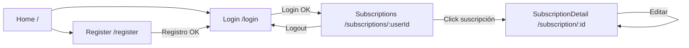

# 📊 Subscription Manager — Frontend

Aplicación web para visualizar y gestionar suscripciones personales con autenticación JWT, gráficos de gasto mensual y formularios reactivos.

Construido con **Angular 21** y **Bootstrap 5**.

---

## 🚀 Tech Stack

| Capa | Tecnología |
|------|------------|
| Framework |  |
| Lenguaje |  |
| UI |  |
| Componentes |  |
| Gráficos |  |
| Estado |  |
| Testing |  |
| Package Manager |  |

---

## ✨ Características

- 🔐 **Autenticación JWT** con login, registro y persistencia en `localStorage`
- 📦 **Gestión completa de suscripciones** (crear, listar, editar, cancelar)
- 📊 **Gráficos de barras** con el coste mensual de cada suscripción
- 💰 **Cálculo automático** del gasto mensual total (normaliza anuales a meses)
- 🎨 **UI con Bootstrap 5** y componentes de ng-bootstrap
- ⚡ **Signals de Angular** para reactividad moderna y de alto rendimiento
- 📝 **Formularios reactivos** con validaciones
- 🧭 **Routing protegido** y navegación con navbar dinámica
- 🏪 **State management** centralizado con `BehaviorSubject`

---

## 🖼️ Capturas de pantalla

> _Próximamente..._ Aquí puedes añadir screenshots de las vistas principales.

---

## 🏗️ Arquitectura

El proyecto usa la arquitectura moderna de Angular con **componentes standalone** y **signals**:

```
src/app/
├── 📁 home/                  # Página de inicio
├── 📁 login/                 # Formulario de login
├── 📁 register/              # Formulario de registro
├── 📁 navbar/                # Barra de navegación
├── 📁 subscriptions/         # Listado + gráfico de suscripciones
├── 📁 subscription-detail/   # Detalle + edición
├── 📁 services/              # Servicios HTTP (Auth, Subscriptions)
├── 📁 store/                 # Estado global (Auth)
├── app.config.ts             # Configuración de la app
├── app.routes.ts             # Rutas
├── app.ts                    # Componente raíz
└── app.html / app.css        # Template raíz
```

---

## 🛣️ Rutas

| Ruta | Componente | Descripción |
|------|------------|-------------|
| `/` | `Home` | Landing page |
| `/login` | `Login` | Iniciar sesión |
| `/register` | `Register` | Crear cuenta |
| `/subscriptions/:userId` | `Subscriptions` | Dashboard de suscripciones + gráfico |
| `/subscription/:subscriptionId` | `SubscriptionDetail` | Detalle y edición |

---

## 🧩 Componentes principales

### 🔑 AuthService (`services/auth.service.ts`)

Gestiona el ciclo de vida de la autenticación:
- `register(data)` — POST `/api/auth/register`
- `login(data)` — POST `/api/auth/login` + guarda token en `localStorage`
- `logout()` — Limpia estado y navega a `/login`
- `getToken()` / `isLoggedIn()`

### 🏪 Store (`store/store.ts`)

Estado global de autenticación basado en `BehaviorSubject`:

```typescript
interface AuthState {
  user: User | null;
  token: string | null;
  isAuthenticated: boolean;
}
```

### 📦 SubscriptionsService (`services/subscriptions.ts`)

CRUD de suscripciones con JWT en headers:
- `getSubscriptionsByUserId(userId)`
- `getSubscriptionById(id)`
- `saveSubscription(subscription)`
- `updateSubscription(id, subscription)`

### 📊 Subscriptions (`subscriptions/`)

Página principal con:
- **Gráfico de barras** (Chart.js) — coste mensual por suscripción
- **Coste mensual total** calculado con `computed()` de Signals
- **Formulario** para crear nuevas suscripciones
- Lista de suscripciones con acceso al detalle

---

## ⚙️ Configuración

### 📋 Requisitos previos

- 🟢 **Node.js 18+**
- 📦 **npm 11+** (o yarn / pnpm compatible)
- 🔗 **Backend** corriendo en `http://localhost:8080` (ver [subscription-manager-back](https://github.com/raullp24/subscription-manager-back))

### 🔌 Configuración del backend

Los servicios HTTP apuntan a `http://localhost:8080` por defecto. Si necesitas cambiarlo, edita:

- `src/app/services/auth.service.ts:9` — URL base de auth
- `src/app/services/subscriptions.ts:12, 21, 30, 39` — URLs de subscriptions

---

## ▶️ Ejecución

### 🏃 Modo desarrollo

```bash
# Clonar el repositorio
git clone https://github.com/raullp24/subscription-manager-front.git
cd subscription-manager-front

# Instalar dependencias
npm install

# Iniciar servidor de desarrollo
npm start
```

> Alias de `ng serve`. La app se abrirá en `http://localhost:4200/`.

### 🏗️ Compilar para producción

```bash
npm run build
```

Los artefactos optimizados se generarán en `dist/`. Configuración por defecto:
- ⚠️ Bundle inicial máximo: **1 MB** (warning en 500kB)
- 🗜️ Hashing habilitado en producción

### 👀 Modo watch (rebuild automático)

```bash
npm run watch
```

### 🧪 Ejecutar tests

```bash
npm test
```

Usa [Vitest](https://vitest.dev/) como test runner.

---

## 🎨 Stack visual

| Componente | Librería |
|------------|----------|
| Layout | Bootstrap 5.3 |
| Componentes UI | ng-bootstrap 20 |
| Iconos / Popovers | @popperjs/core |
| Gráficos | Chart.js + ng2-charts |
| Formato de código | Prettier (`printWidth: 100`, single quotes) |

---

## 🔄 Flujo de la aplicación



---

## 🔐 Autenticación

El token JWT se guarda en `localStorage` bajo la clave `token` y se envía en cada request HTTP protegido:

```typescript
headers: {
  'Authorization': `Bearer ${token}`
}
```

El `Store` se hidrata al iniciar la app si detecta token + usuario en `localStorage`, manteniendo la sesión activa entre recargas.

---

## 🤝 Proyecto relacionado

> ⚙️ **Backend** de esta aplicación: [subscription-manager-back](https://github.com/raullp24/subscription-manager-back)
> API REST en Spring Boot 3.4 con MongoDB y JWT.

---

## 📄 Licencia

Este proyecto es de uso personal. Siéntete libre de revisarlo y aprender de él.

---

<p align="center">Hecho con 🅰️ y Angular</p>
